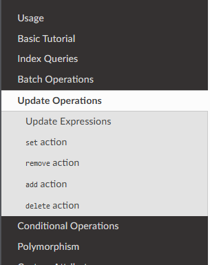

이번 글은 나의 첫 번째 오픈소스 컨트리뷰팅 후기이다!

## 0. 오픈소스 컨트리뷰팅이란?

요즘 잘 나가는 생성형 검색엔진인 Perplexity에게 물어보았다.

> 오픈소스 컨트리뷰팅은 오픈소스 프로젝트에 참여하고 기여하는 모든 활동을 의미합니다. 주요 특징과 유형은 다음과 같습니다:
> - 컨트리뷰팅의 정의
>   - 오픈소스 프로젝트의 발전에 기여하는 모든 형태의 참여 활동
>   - 코드 작성뿐만 아니라 다양한 비코딩 활동도 포함
>
> 오픈소스 컨트리뷰션의 종류는 크게 코딩 기여와 비코딩 기여로 나눌 수 있습니다. 주요 유형은 다음과 같습니다:
> - 코딩 기여
>   - 새로운 코드 작성: 새로운 기능 추가나 기존 기능 개선
>   - 버그 수정: 문제 진단 및 해결
>   - 코드 리팩토링: 코드 구조 개선
>   - API 설계 및 유지보수
>   - 성능 최적화
>   - 테스트 코드 작성: 단위 테스트, 통합 테스트 등
>
> - 비코딩 기여
>   - 문서화: 사용 설명서, API 문서, 튜토리얼 작성
>   - 번역 및 현지화
>   - 디자인: 로고, 아이콘, UI/UX 디자인
>   - 버그 트리아지: 버그 보고 및 분류
>   - 커뮤니티 관리: 이벤트 조직, 사용자 지원
>   - 마케팅 및 홍보: 소셜 미디어 관리, 기술 기사 작성
>   - 품질 보증 및 테스팅
>   - 보안 관련 활동
>   - 웹사이트 개발 및 유지보수
>   - 법률 자문 및 재무 관리
> 
> 이러한 다양한 유형의 기여는 오픈소스 프로젝트의 전반적인 건강성과 성숙도를 나타내며, 코딩 능력 외에도 다양한 전문성을 가진 사람들이 프로젝트에 참여할 수 있는 경로를 제공합니다

이번 글에서는 비코딩 기여를 한 경험을 풀어본다.

## 1. 직접 오픈소스 문서를 수정해보기로 결심하다.
현업에서 dynamoDB를 ORM처럼 사용할 수 있도록 도와주는 PynamoDB를 잘 사용하고 있는데, 그 와중에 몇 달 전부터 공식 문서에 눈에 거슬리는 부분이 있었다. 바로 아래 목차부분이었는데, "set  action"부분만 뭐가 잘못 되었는지 들여쓰기가 되어 있었다. 아무리 봐도 나머지 Action들과 동일한 레벨에 있어야 하는 거 아닌가 싶었다.

[아무리 봐도 set action이 거슬린다]

내가 몇 개월 동안 지켜봤는데도 그대로이기도 하고, 의외로 수정사항이 적을 것 같아서 직접 수정을 시도해보기로 했다. 

## 2. 컨트리뷰팅 규칙을 알아보다
우선 PynamoDB 깃헙에 가서 컨트리뷰팅 관련 규칙이 있는지 확인해보았다. 

docs/contributing.rst라는 파일이 있어 확인해보니, 단순하게 master 브랜치를 포크해서 수정한 후에 pull request를 하면 되는 것을 확인했다. 물론 테스트를 통과해야하고, 필요 시 관련 문서도 추가 작성해야하지만 나는 공식문서 오타를 고치는 수준이라 크게 상관 없었다.

(코드 수정에 따른 테스트 및 문서 수정은 당연한 것!)

## 3. 포크뜨고, 본격적으로 수정하다
우선 master 브랜치를 내 깃헙 저장소에 포크한 후, 로컬에서 문서 수정용 브랜치를 하나 만들었다. 브랜치 명명 규칙도 따로 없는 것 같아서 그냥 가독성 좋게 내 맘대로 지었다. (dubli91:fix-doc-updates)

코드를 찾아보니 수정이 필요한 파일은 docs/updates.rst 였다. rst파일은 처음 다뤄보는 거라 찾아보니, reStructuredText의 약자로서 파이썬에서 주로 쓰이는 기술 문서 파일 형식이라고 한다.
처음부터 rst파일의 문법을 공부할 엄두는 안 나서 문서의 "set action"항목과 나머지 action항목의 차이점을 비교해보니, 의외로 문제점을 쉽게 파악할 수 있었다.

set action은 위와 같이 """"가 아래에 붙고

그 외의 action은 ^^^^가 붙는다. 

"set action" 아래에 있던 """""""""""""" 를 다른 action들 아래 있는 ^^^^^^^^^^^^^^ 로 동일하게 바꿔주었다.
(확인 결과, rst파일에서는 " 가 ^ 보다 낮은 수준의 섹션 레벨을 표시한다고 한다)

## 4. 테스트를 진행하다
이제 실제로 동작하는지를 테스트해봐야하는데, 여기서 좀 시간이 오래 걸렸다. PynamoDB 공식문서를 어떻게 빌드하는지를 몰랐기 때문이다.

처음에 시도했던 것은 vscode의 rst 뷰어 플러그인이었다. 하지만 플러그인으로 미리보기를 확인한 순간 무언가 잘못되었음을 깨달았다.

[사이드바는 어디에?..]

포크했던 PynamoDB 코드를 더 찾아보니 .readthedocs.yaml이라는 파일에 어떻게 빌드하는지 나와있었다. 

Sphinx는 또 뭔가? ChatGPT에게 물어봤다.

> Sphinx는 Python으로 작성된 강력한 문서화 도구로, 주로 소프트웨어 프로젝트의 문서를 자동화하여 생성하는 데 사용됩니다. Sphinx는 특히 Python 프로젝트에서 많이 사용되지만, Python 외의 프로젝트에서도 활용할 수 있는 범용 도구입니다. Sphinx는 다양한 소스 파일 포맷을 사용하여 HTML, PDF, ePub 같은 여러 출력 형식을 지원합니다.

ChatGPT에서 빌드 방법도 물어보고 따라서 빌드를 해 보니 html 폴더가 생겼다. 크롬으로 열어보니 정상적으로 수정된 것을 확인했다!

## 5. 풀리퀘스트를 열다
수정도 끝났고 테스트도 끝났으니 풀 리퀘스트를 열어본다!

곧바로 approve가 되었다. 하지만 머지는 어떻게 해야하나? 심지어 Github Action으로 돌아가던 테스트는 일부 실패했다. 하지만 나는 단순 문서 수정이고 실패한 것은 python 테스트이니 내 잘못은 아니다.

그래도 혹시나 몰라서 아래와 같이 댓글을 달았는데, 리뷰어도 별 문제 없을 거라 생각했는지 바로 머지 해줬다.

끼얏호우!

이제 공식 문서를 다시 들어가본다. 공식 문서 버전을 stable에서 latest로 바꿔보면 내가 수정한 부분이 반영되어 있다!

[적용 완료!]

## 6. 느낀 점

- 오픈소스 컨트리뷰팅는 의외로 쉬웠다!
  - 당장 프로젝트 코드 전체를 이해하지 못하더라도, 비코딩 컨트리뷰팅는 나 같은 초심자도 쉽게 접근할 수 있었다
  - 물론, PynamoDB의 컨트리뷰팅 규칙이 좀 지나치게 쉬운 감이 있었다
- 뿌듯하다!
  - 주변에 자랑하기 좋다
  - 앞으로 자주 해야겠다